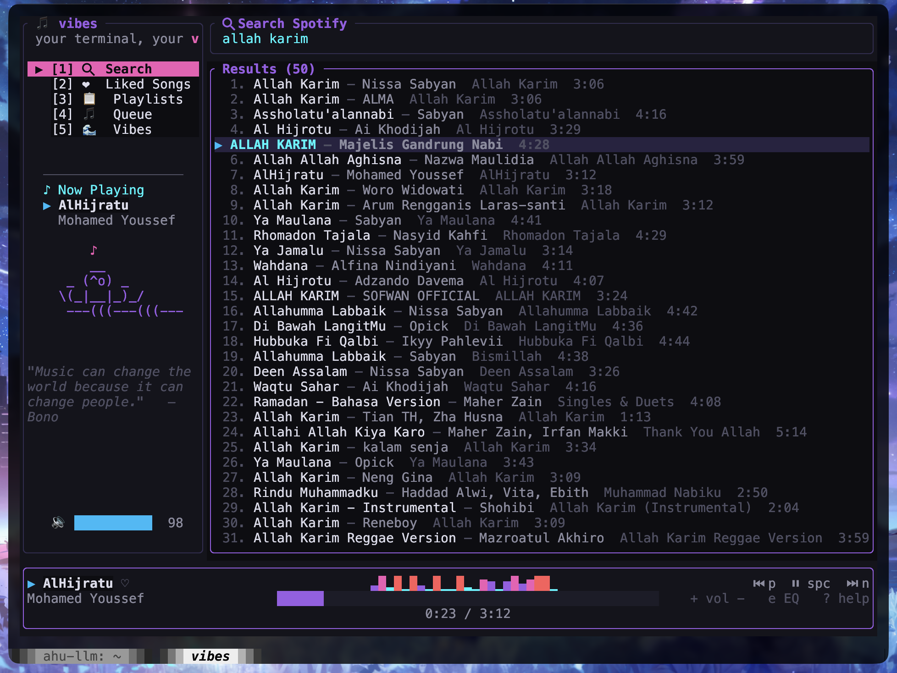

# 🎵 vibes

> *your terminal, your vibe* — a beautiful, feature-rich Spotify TUI player written in Rust.

[](https://www.rust-lang.org/)
[](LICENSE)



## 📖 Introduction

**Vibes** is a terminal-based UI (TUI) client for Spotify designed with aesthetics and functionality in mind. Built with Rust, Ratatui, and Crossterm, it delivers a smooth, native-feeling music experience directly in your terminal. 

Whether you're coding, writing, or just browsing, Vibes provides an immersive interface complete with animated equalizers, dynamic playback controls, and a vibrant neon-dark theme. Say goodbye to heavy desktop applications and control your music lightning-fast from your keyboard.

## ✨ Features

| Feature | Description |
|---|---|
| 🔍 **Search** | Instantly search tracks across Spotify's entire catalog. |
| ❤ **Liked Songs** | Browse, scroll, and play your saved tracks directly. |
| 📋 **Playlists** | View all your custom and followed playlists and their songs. |
| 🎵 **Queue Management**| View your upcoming tracks and seamlessly add new songs to your queue. |
| 🌊 **Vibes Discovery** | Mood-based song recommendations (Chill, Hype, Focus, Happy, Dark). |
| ≋ **Animated UI** | Includes a live dancing cat/monkey visualizer, rotating quotes, and an animated equalizer bar! |
| 🎧 **Full Playback** | Non-blocking controls for play/pause, skip, seek, and volume adjustments. |
| ✨ **Optimistic UI** | Immediate visual feedback when skipping tracks or changing states. |
| ❓ **Built-in Help** | Press `?` anytime for an interactive keybindings menu. |

---

## 🚀 Setup & Installation

### Requirements
- **Rust 1.75+** installed via [rustup](https://rustup.rs/).
- **Spotify Premium** account (Note: Spotify API enforces Premium for playback control).
- **Docker** (Optional, but highly recommended for the local Redis token cache).

### 1. Create a Spotify Developer App
To access the Spotify API, you need your own client credentials.
1. Go to the [Spotify Developer Dashboard](https://developer.spotify.com/dashboard).
2. Click **Create app**.
3. Fill in the App Name and Description (e.g., "Vibes Terminal").
4. Under **Redirect URIs**, add exactly: `http://127.0.0.1:8989/login`.
5. Save your app and navigate to the **Settings** page.
6. Copy the **Client ID** and **Client Secret**.

### 2. Configure Credentials
Clone the repository and create a `.env` file in the root directory:

```bash
git clone https://github.com/yourusername/vibes.git
cd vibes
touch .env
```

Paste your credentials into the `.env` file:
```env
SPOTIFY_CLIENT_ID=your_client_id_here
SPOTIFY_CLIENT_SECRET=your_client_secret_here
SPOTIFY_REDIRECT_URI=http://127.0.0.1:8989/login
REDIS_URL=redis://127.0.0.1:6379
RUST_LOG=vibes=info
```

### 3. Spin up Redis (Recommended)
Vibes uses Redis to securely cache your Spotify login token so you don't have to log in every time you open the app.
```bash
docker compose up -d
```

### 4. Build and Run

#### Development Mode
```bash
cargo run
```

#### Production / Release Mode
When building the release binary, you must ensure that the `.env` file is located in the same directory where you execute the binary, or that the environment variables are exported globally.
```bash
# Compile optimized build
cargo build --release

# Copy the .env file next to the binary (so it can read your credentials)
cp .env target/release/

# Run the binary directly
cd target/release
./vibes
```

### 5. Authentication
On the first run, Vibes will automatically open your default web browser asking you to grant permissions to your Spotify account. Click **Agree**. The browser will redirect to `localhost:8989` and the terminal will automatically log you in.

---

## ⌨️ Keybindings

| Key | Action |
|---|---|
| `↑ / k` | Navigate up |
| `↓ / j` | Navigate down |
| `← / h` | Navigate left / go back |
| `→ / l` | Navigate right |
| `Enter` | Select / Play track |
| `Esc / b` | Back / Cancel search / Close help |
| `Space` | Pause / Resume playback |
| `n` | Next track |
| `p` | Previous track |
| `f / →` | Seek forward 10s |
| `r / ←` | Seek backward 10s |
| `+ / =` | Volume up |
| `-` | Volume down |
| `l` | Like / Unlike current track |
| `a` | Add selected track to queue |
| `s` | Focus Search input |
| `1` | Menu: Search |
| `2` | Menu: Liked Songs |
| `3` | Menu: Playlists |
| `4` | Menu: Queue |
| `5` | Menu: Vibes (Moods) |
| `?` | Toggle help popup |
| `e` | Toggle big EQ player view |
| `q` | Quit application |

---

## 🛠 Troubleshooting Guide

Having issues? Here are the most common problems and how to fix them.

### 1. Error: "400 Bad Request" when using Search or Library
- **Cause:** Your saved Spotify token has expired or is invalid.
- **Fix:** The app is designed to auto-refresh tokens. However, if the error persists, open your terminal and clear the cache using Redis, or simply delete the token:
  ```bash
  docker exec -it vibes-redis-1 redis-cli del vibes:spotify_token
  ```
  Restart `cargo run` and log in through the browser again.

### 2. Can't play songs ("No active device found")
- **Cause:** Spotify API requires an "active device" to trigger playback, but doesn't consider the API itself a physical player.
- **Fix:** Open the official Spotify app on your phone, desktop, or web browser. Play any song for 1 second, then pause it. Now your device is "active", and you can control it from Vibes.

### 3. Next Track (`n`) or Previous Track (`p`) isn't working / Queue is repetitive
- **Cause:** You started playing a single song manually via the Spotify app, so the active Spotify queue context is empty.
- **Fix:** Start playing a song directly from within the **Vibes app** (e.g., press `Enter` on a song in Search or Liked Songs). Vibes automatically feeds the next 50 tracks to Spotify, immediately fixing the queue and enabling the Next/Prev buttons.

### 4. Broken Layout or Weird Characters
- **Cause:** Your terminal emulator does not fully support Unicode or strict monospace fonts.
- **Fix:** Ensure you are using a modern terminal (like iTerm2, Alacritty, Kitty, or Windows Terminal) and a patched Nerd Font (e.g., FiraCode Nerd Font). Expand your terminal window to ensure sidebar elements aren't squished.

### 5. `cargo run` fails to compile
- **Cause:** Missing dependencies or outdated Rust version.
- **Fix:** Run `rustup update` to ensure you are on Rust 1.75 or newer. Also, ensure you don't have broken `Cargo.lock` files; try `cargo clean` and run again.

### 6. Where are the logs?
- **Logs location:** If the app crashes, it writes an error trace to `/tmp/vibes.log`.
- **View logs:** Run `tail -f /tmp/vibes.log` in another terminal window while running the app to see live API activity and error notices.

---

## 📝 Architecture

Vibes runs purely on asynchronous Rust (`tokio`), separating UI rendering (`ratatui`) from API network calls (`rspotify`).

```
src/
├── main.rs          # Entry point, terminal setup, panic hook
├── app/             # Main event loop, global state, UI dispatch
├── spotify/         # Spotify API wrappers, OAuth caching, pagination
├── ui/              # Render logic, neon theme, dynamic layouts
├── events/          # Keyboard mapping
├── cache/           # Redis local token store
└── config/          # Dotenv configuration
```

## 📜 License
MIT
